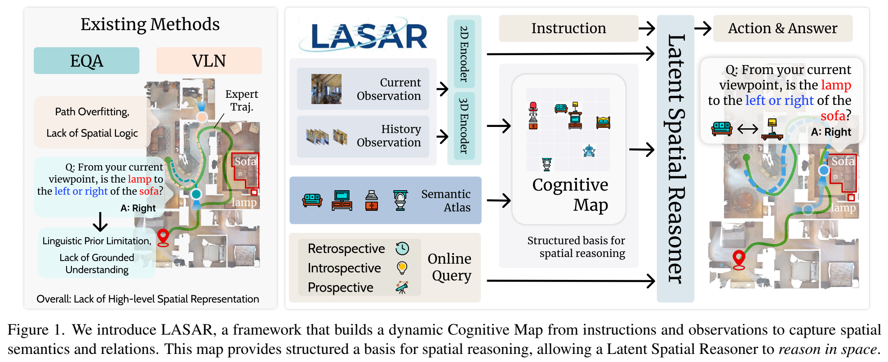

<div align="center">

# LASAR: Towards Spatio-temporal Reasoning with Latent Cognitive Map

**CVPR 2026**

[Jinzhou Tang](https://tangjzh.github.io) · Sidi Liu · Waikit Xiu · Weixing Chen · Keze Wang

Sun Yat-sen University

[](https://arxiv.org/abs/2605.16899)
[](https://github.com/tangjzh/LASAR)

</div>

<p align="center">
  
</p>

## Overview

**LASAR** (LAten SpAtial Reasoner) is an LLM-based embodied agent with a **dual-memory** design: episodic memory over geometry-aware visual history, and a **latent cognitive map** built from a learnable Spatial Semantic Atlas. The map is trained with **Spatio-temporal Contextual Representation Learning (ST-CRL)**, a contrastive objective driven by **MindCraft**—cognitive queries injected into VLN-CE navigation episodes (retrospective, introspective, and prospective probes).

This repository provides:

- LASAR model and training code (built on [NaVILA](https://github.com/aigc-iast/NaVILA) / [Qwen2.5-VL](https://github.com/qwenlm/qwen3-vl))
- **MindCraft** benchmark: inference and metrics (QA-Acc, CMC, GCA, SR@WA)
- Scripts to export LASAR submodule weights (`lasar_modules.bin`)

## News

- **[2026.05]** Code and MindCraft evaluation released.
- **[2026.06]** CVPR 2026 poster — Sat, Jun 6, 3:45–5:45 PM PDT, ExHall A & F ([poster](https://cvpr.thecvf.com/virtual/2026/poster/36306)).

## Resources

| Resource | Description | Link |
|:---------|:------------|:-----|
| Paper | LASAR + ST-CRL + MindCraft | [arXiv:2605.16899](https://arxiv.org/abs/2605.16899) |
| Code | Training & evaluation | [github.com/tangjzh/LASAR](https://github.com/tangjzh/LASAR) |
| MindCraft dataset | VLN-CE episodes with cognitive queries (~8.2k trajectories, ~210GB) | [🤗 `TMarcus/MindCraft`](https://huggingface.co/datasets/TMarcus/MindCraft) |
| Checkpoints | LASAR weights | [🤗 `tangjzh/LASAR-8B`](https://huggingface.co/tangjzh/LASAR-8B) *(coming soon)* |

## Installation

```bash
conda create -n lasar python=3.10 -y
conda activate lasar
bash environment_setup.sh
pip install git+https://github.com/facebookresearch/vggt.git
```

`environment_setup.sh` installs the package in editable mode and applies the NaVILA/VILA transformers & DeepSpeed patches.

## Data preparation

Download MindCraft and point the codebase to it:

```bash
huggingface-cli download tangjzh/MindCraft --repo-type dataset --local-dir data/dataset/mindcraft
export MINDCRAFT_DATA_ROOT=$(pwd)/data/dataset/mindcraft
```

Each episode is a folder (e.g. `000001/`) containing `data.npz` (instruction, `mindcraft_queries`, scene metadata) and egocentric video. See the dataset card on Hugging Face for the full schema.

Download a NaVILA-8B base checkpoint separately and place it under `ckpt/` (not included in this repo).

## Training

Fine-tune on R2R/RxR + MindCraft (default recipe):

```bash
export MODEL_PATH=./ckpt/navila-llama3-8b-8f
bash scripts/train/lasar_train_mindcraft.sh
```

To train LASAR cognitive-map modules (ST-CRL / `[MAP]` injection), enable:

```bash
--use_lasar_injection True --tune_lasar_modules True
```

Export LASAR weights from a DeepSpeed checkpoint:

```bash
python scripts/export_lasar_modules.py ckpt/<run>/checkpoint-<step>
# -> ckpt/<run>/checkpoint-<step>/lasar/lasar_modules.bin
```

## MindCraft evaluation

```bash
bash evaluation/scripts/eval/mindcraft.sh \
  ./ckpt/<checkpoint> \
  "$MINDCRAFT_DATA_ROOT" \
  eval_out/mindcraft \
  "0,1,2,3"
```

Results are written to `eval_out/mindcraft/metrics_results/metrics_results.json`. For GCA and SR@WA, use `evaluation/scripts/eval/mindcraft_with_nav.sh` with navigation success labels. Details: [evaluation/README.md](evaluation/README.md).

## Project structure

```
LASAR/
├── llava/                 # Model, MindCraft dataset loader, training
├── evaluation/            # mindcraft_inference.py, mindcraft_metrics.py
├── scripts/
│   ├── train/             # lasar_train_mindcraft.sh, sft_8frames.sh
│   └── export_lasar_modules.py
└── tests/
```

## Acknowledgements

This project builds on [NaVILA](https://github.com/aigc-iast/NaVILA), [LLaVA](https://github.com/haotian-liu/LLaVA), [VLN-CE](https://github.com/jacobkrantz/VLN-CE), [SigLIP](https://github.com/google-research/big_vision), and [VGGT](https://github.com/facebookresearch/vggt).

## License

This project is released under the [Apache 2.0 License](LICENSE).

## Citation

If you find this work useful, please cite:

```bibtex
@article{tang2026lasar,
  title={LASAR: Towards Spatio-temporal Reasoning with Latent Cognitive Map},
  author={Tang, Jinzhou and Liu, Sidi and Xiu, Waikit and Chen, Weixing and Wang, Keze},
  journal={arXiv preprint arXiv:2605.16899},
  year={2026}
}
```
